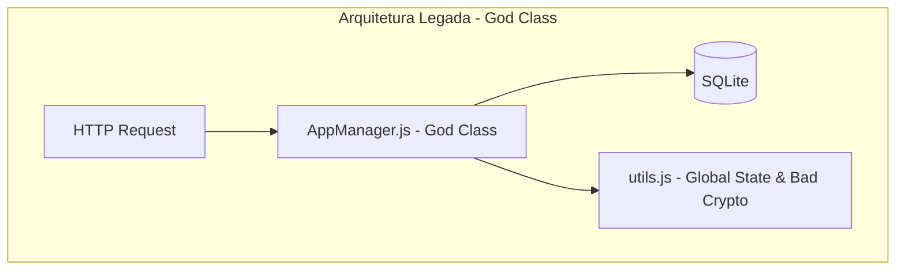
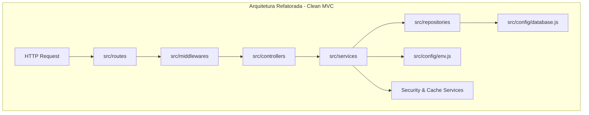

# Refatoração Arquitetural - LMS E-Commerce API Legacy

Este repositório contém a refatoração completa da API legada de e-commerce/LMS, migrando de uma arquitetura monopólio ("God Class") para uma arquitetura MVC (Model-View-Controller) modular, escalável, testável e desacoplada em Node.js / Express.

---

## A) Análise Manual (Manual Analysis)

### 1. Problemas Identificados e Classificação de Severidade

* **[CRITICAL] Anti-Pattern: The God Class / Spaghetti Route**
  * **Arquivo/Linhas:** `src/AppManager.js` (linhas 4-139)
  * **Justificativa:** A classe `AppManager` concentrava inicialização do banco, schema DDL, inserção de seeds, roteamento HTTP, parsing de requisição, validações, processamento de pagamento, relatórios com loops assíncronos e logs de auditoria. Violação direta do Princípio da Responsabilidade Única (SRP).

* **[CRITICAL] Anti-Pattern: Hardcoded Secrets & Insecure Crypto**
  * **Arquivo/Linhas:** `src/utils.js` (linhas 1-7, 17-23)
  * **Justificativa:** Credenciais de banco de dados (`dbUser`, `dbPass`), chave de gateway de pagamento (`paymentGatewayKey`) e configurações SMTP hardcoded no código-fonte. Uso de `badCrypto` (algoritmo caseiro baseado em concatenações e substrings de base64) para hash de senhas.

* **[HIGH] Anti-Pattern: Fat Controllers & Callback Hell**
  * **Arquivo/Linhas:** `src/AppManager.js` (linhas 28-78)
  * **Justificativa:** Rota `/api/checkout` implementada via callbacks aninhados em 6 níveis de profundidade. Regras de negócio de pagamento e matrícula presas no handler HTTP.

* **[HIGH] Anti-Pattern: Global Mutable State & Missing Dependency Injection**
  * **Arquivo/Linhas:** `src/utils.js` (linhas 9-10), `src/AppManager.js` (linha 7)
  * **Justificativa:** Uso de variáveis globais mutáveis (`globalCache`, `totalRevenue`). Instanciação direta da conexão SQLite no construtor da classe sem Injeção de Dependências.

* **[MEDIUM] Anti-Pattern: N+1 Query Problem**
  * **Arquivo/Linhas:** `src/AppManager.js` (linhas 80-129)
  * **Justificativa:** O endpoint `/api/admin/financial-report` realizava queries SQL encadeadas dentro de múltiplos loops `forEach` (cursos -> matrículas -> usuários -> pagamentos), gerando $O(N \times M)$ chamadas ao banco de dados.

* **[MEDIUM] Anti-Pattern: Missing Input Validation & Referential Integrity Issues**
  * **Arquivo/Linhas:** `src/AppManager.js` (linhas 28-36, 131-137)
  * **Justificativa:** Ausência de validação de schemas/formatos de e-mail/parâmetros. Exclusão de usuários via `DELETE` deixava registros órfãos nas tabelas `enrollments` e `payments`.

* **[LOW] Anti-Pattern: Magic Strings & Magic Numbers**
  * **Arquivo/Linhas:** `src/AppManager.js` (linha 46, 68), `src/utils.js` (linha 6)
  * **Justificativa:** Regras de negócio e status codificados diretamente como literais (`"4"`, `"PAID"`, `"DENIED"`, `"123456"`).

---

## B) Construção da Skill & Decisões de Design (Skill Construction)

### Decisões Arquiteturais
1. **Camada MVC + Repository Pattern:**
   * `routes/`: Define apenas as rotas e mapeia os middlewares.
   * `controllers/`: Recebe as requisições HTTP, repassa para os serviços e retorna respostas formatadas.
   * `services/`: Contém todas as regras de negócio puras (Checkout, Relatório Financeiro, Gestão de Usuários, Criptografia).
   * `repositories/`: Encapsula todas as operações de banco de dados SQLite de forma promisificada.
   * `config/`: Centraliza variáveis de ambiente e conexão com o banco de dados.
   * `middlewares/`: Validação de requisições e tratamento centralizado de erros.

2. **Mitigação do N+1 Query Problem:**
   * Refatorado para uma consulta única com `LEFT JOIN` agrupando Cursos, Matrículas, Usuários e Pagamentos no `PaymentRepository`, reduzindo as viagens ao banco de dados de $O(N \times M)$ para $O(1)$.

3. **Injeção de Dependência:**
   * Todos os Services e Repositories recebem suas dependências via construtor com valores padrão, permitindo testes unitários com mocks sem alterar a assinatura das classes.

4. **Tratamento Centralizado de Erros:**
   * Substituição de blocos `try/catch` dispersos por um middleware global de erros (`errorHandlerMiddleware.js`) que captura exceções e formata a resposta HTTP padronizada.

5. **Manutenção do Desacoplamento Tecnológico (Tech-Agnostic):**
   * Padrões aplicados (MVC, Repository, DI, Layering, Centralized Errors) são independentes de framework e aplicáveis em Node.js, Python, Java, C#, Go, PHP, etc.

---

## C) Resultados (Results)

### Audit Report Summary
* **Severidade das Falhas Encontradas:** 2 CRITICAL, 2 HIGH, 2 MEDIUM, 1 LOW.
* **Status:** 100% Mitigados na refatoração.

### Comparativo Arquitetural Antes vs Depois





### Checklist de Validação
- [x] Boot da aplicação realizado com sucesso.
- [x] Endpoint `POST /api/checkout` (Sucesso & Recusado) respondendo perfeitamente.
- [x] Endpoint `GET /api/admin/financial-report` retornando dados agregados sem N+1 queries.
- [x] Endpoint `DELETE /api/users/:id` deletando usuário e limpando referências associadas.
- [x] Padrões de anti-pattern (God Class, Hardcoded Secrets, Callback Hell, N+1) completamente eliminados.
- [x] Configuração centralizada via `.env` e tratamento global de erros ativos.

### Logs de Execução dos Testes
```text
LMS Refactored API rodando na porta 3000...
--- TEST 1: Checkout Success ---
Processando cartão 4111222233334444 na chave pk_live_1234567890abcdef
[LOG] Salvando no cache: last_checkout_2
Status: 200 Response: {"msg":"Sucesso","enrollment_id":2}

--- TEST 2: Checkout Denied ---
Processando cartão 5111222233334444 na chave pk_live_1234567890abcdef
[ERROR] Error: Pagamento recusado
Status: 400 Response: Pagamento recusado

--- TEST 3: Financial Report ---
Status: 200 Response: [{"course":"Clean Architecture","revenue":997,"students":[{"student":"Leonan","paid":997}]},{"course":"Docker","revenue":497,"students":[{"student":"Guilherme","paid":497}]}]

--- TEST 4: Delete User ---
Status: 200 Response: Usuário e matrículas associadas deletados com sucesso.
```

---

## D) Como Executar (How to Execute)

### Pré-requisitos
* Node.js v16+
* npm

### Passos de Instalação e Execução
```bash
# 1. Instalar as dependências
npm install

# 2. Copiar as variáveis de ambiente (opcional, padrão embutido em config/env.js)
cp .env.example .env

# 3. Iniciar o servidor
npm start
```

O servidor estará rodando em `http://localhost:3000`.

## Segunda execução da skill `refactor-arch` (21/08/2026)

Os segredos hardcoded e o fallback `badCrypto` foram removidos, assim como o módulo legado que ainda os continha. Em produção, `DB_USER`, `DB_PASS`, `PAYMENT_GATEWAY_KEY` e `SMTP_USER` são obrigatórios; o hash de senha usa `scrypt` com salt aleatório. O boot foi validado com Node e o scan não encontrou os padrões inseguros.

### Como Validar as Rotas (com cURL ou arquivo api.http)
```bash
# Checkout com Sucesso
curl -X POST http://localhost:3000/api/checkout \
  -H "Content-Type: application/json" \
  -d '{"usr":"Guilherme","eml":"gui@fullcycle.com.br","pwd":"senhaforte","c_id":2,"card":"4111222233334444"}'

# Checkout Recusado
curl -X POST http://localhost:3000/api/checkout \
  -H "Content-Type: application/json" \
  -d '{"usr":"João","eml":"joao@teste.com","pwd":"123","c_id":1,"card":"5111222233334444"}'

# Relatório Financeiro Administrativo
curl -X GET http://localhost:3000/api/admin/financial-report

# Deletar Usuário
curl -X DELETE http://localhost:3000/api/users/1
```
